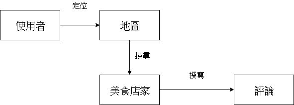
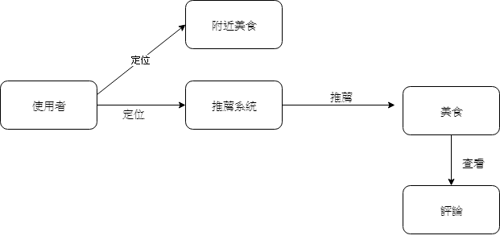
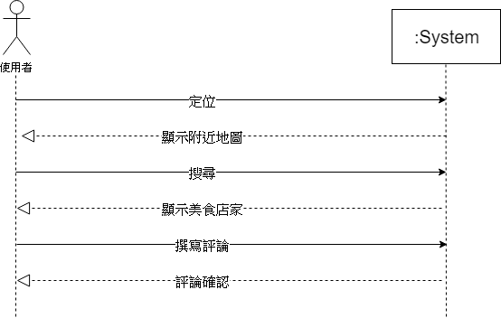
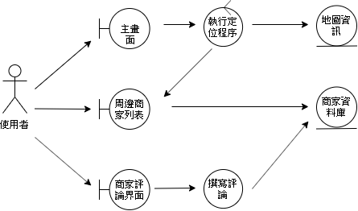
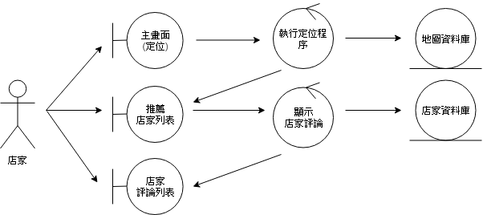
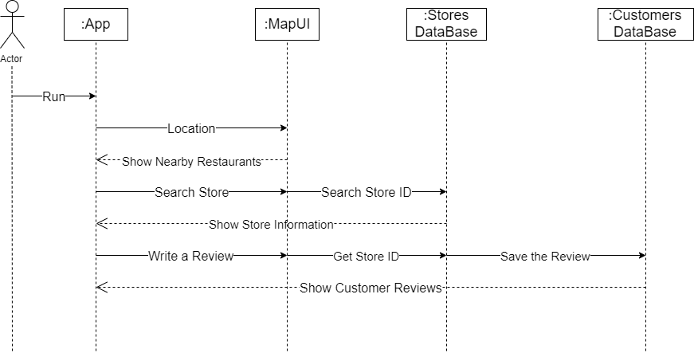
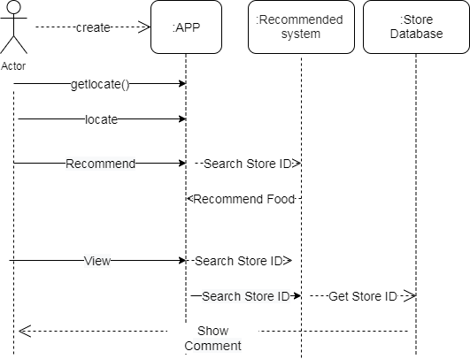

# 專題名稱：MemoryOfFood 
## 第12組 組長:林鈺真 組員:翁敏婧、陳怡文、陳乃瑄

1. 專題題目：
   > 咕嚕咕嚕美食地圖
2. 文字敘述專題需求：
   > 有鑑於現代人們對於吃的需求，我們不僅提供搜尋餐館外，更提供在視覺上與社群上獲得額外的"回饋"。因此我們所做的系統-咕嚕咕嚕美食地圖，結合Google Map、提供使用者做評論以及採點次數留下美食回憶等。我們希望此系統不僅止於提供"尋找吃"，更能留下"美食的回憶"。
    
3. 寫出專題之功能性需求與非功能性需求：
   > 功能性：
   
   * 評論：撰寫評論。
   * 搜尋：搜尋美食或店家。
   * 排行：根據評論紀錄提供推薦美食、熱門商家排行。
   
   > 非功能性：
   
   * 操作：使用者能看見歷程美食評論的紀錄。
   * 效能：系統每半天更新排行榜資訊。
   * 安全：只有使用者或管理者可以看到定位紀錄。
   
4. 畫出 使用案例圖 (use case diagram)：

5. 由上而下排出 使用案例的重要性：
   * 搜尋
   * 評論
   * 排行

6. 寫出 其中的 至少三個使用案例：
   > 生命中的美食記事本。
   
   1. 有天小敏肚子餓，打開了APP，使用定位搜尋附近的美食。點開店家資訊並查詢評價，小敏覺得可以，就到店家享用美食。小敏吃完後，覺得相當不錯，所以就到APP上評價此店。
   
   
   > 對於選擇障礙的人來說，推薦美食是不錯的選擇。
   
   2. 又到了吃午餐的時候，此時的小條文想到外面吃飯，但又不知道附近有什麼好吃的，所以她打開了APP，定位後，推薦系統出現了許多美食，點選美食後查看評價，小條文覺得非常可以，也解決了她每天的煩惱。
   
   
   > 商家可藉由此系統的評論，找出改進之處。
   
   3. 阿瑄開設了一家快炒店，開幕沒多久，顧客就越來越少了，阿瑄覺得這樣不行，於是她找了當下最流行美食APP，藉由APP上的評價系統，阿瑄從APP上知道了他的優缺點，藉由改善這些缺點後，他的快炒店蒸蒸日上，可喜可賀。   
  
  
7. 寫出 user story：
   > 身為一個使用者，我希望能藉由搜尋美食或店家，進而發掘新美食與新店家。

   > 身為一個使用者，我希望能看到美食評論，這樣才能從評論中判斷有沒有符合自己的喜好。

   > 身為一個使用者，我希望能藉由排行，發現自己從未嘗試的店家。
   
8. 初步類別圖：

   1. 初步類別圖_使用案例圖1
   
       
   
   2. 初步類別圖_使用案例圖2
   
       
   
   3. 初步類別圖_使用案例圖3
   
       
   

9. 系統循序圖：

   1. 系統循序圖_使用案例圖1
   
        
   
   2. 系統循序圖_使用案例圖2
   
        
   
   3. 系統循序圖_使用案例圖3
   
        
   
      
10. 強韌圖：

      1. 強韌圖_使用案例圖1
   
         
   
      2. 強韌圖_使用案例圖2
   
         
   
      3. 強韌圖_使用案例圖3
   
         
   

11. 循序圖：

      1. 循序圖_使用案例圖1
   
         
   
      2. 循序圖_使用案例圖2
   
         
   
      3. 循序圖_使用案例圖3
   
         
